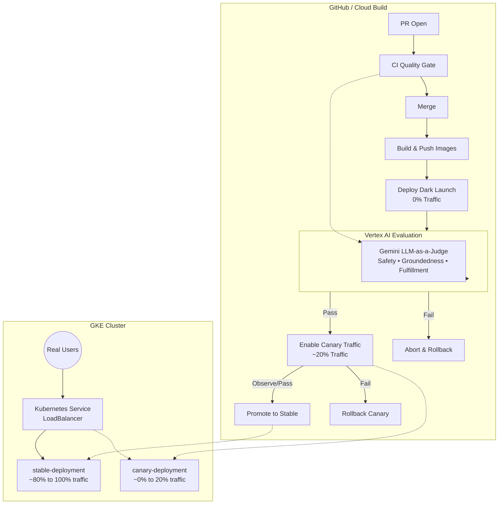

# GCP Agent Evaluation — Reference Implementation

A **production-grade reference** for evaluating, deploying, and continuously validating LLM-based multi-agent systems on Google Cloud Platform using GKE, Vertex AI Evaluation, and GitHub Actions.

> **Use case:** An Intelligent Customer Resolution Hub that routes support tickets to billing, technical, and account sub-agents. The same patterns apply to any multi-agent system.

---

## Architecture Overview



---

## Project Structure

```
agent-evaluation-reference/
│
├── agent/                        # Deployable agent microservice
│   ├── app/
│   │   └── main.py               # FastAPI server: /predict /health /ready /version
│   └── requirements.txt
│
├── deploy/k8s/                   # GKE Kubernetes manifests
│   ├── namespace.yaml
│   ├── stable-deployment.yaml    # Production (9 replicas, ~90% traffic)
│   ├── canary-deployment.yaml    # Canary (1 replica, ~10% traffic) + canary Service
│   ├── service.yaml              # Main LoadBalancer Service (selects all pods)
│   └── hpa.yaml                  # Horizontal Pod Autoscaler for stable
│
├── scripts/
│   ├── sanity_check.py           # 7-check fast pre-eval health check
│   └── promote_canary.sh         # Promotes canary → stable after gate passes
│
├── src/agent_eval/               # Evaluation framework (Python package)
│   ├── agent/
│   │   ├── core.py               # Mock agent (used in CI — no deployment needed)
│   │   └── endpoint.py           # HTTP client for live agent (used in CD)
│   ├── evaluation/
│   │   ├── runner.py             # Vertex AI EvalTask orchestration + quality gate
│   │   └── metrics.py            # Custom PointwiseMetricPromptTemplate rubric
│   └── utils/
│       ├── config.py             # GCP project resolution
│       └── logger.py             # Structured logging setup
│
├── data/
│   └── golden_dataset.json       # Evaluation test cases (prompts + references)
│
├── tests/                        # Unit tests (mocked, no GCP calls)
│
├── .github/workflows/
│   ├── ci.yml                    # CI quality gate (runs on every PR)
│   └── cd.yml                    # CD canary deploy + quality gate (runs on merge)
│
├── Dockerfile                    # Multi-stage build for GKE deployment
├── pyproject.toml                # Package config + CLI entrypoint
└── cloudbuild.yaml               # GCP Cloud Build alternative pipeline
```

---

## CI vs CD Quality Gate — Key Difference

| | CI Gate | CD Gate |
|---|---|---|
| **Triggers on** | Pull Request | Merge to `main` |
| **Agent used** | Local mock (Gemini direct call) | Real deployed canary pod on GKE |
| **Tools/sub-agents** | Mocked | Real (billing API, RAG, etc.) |
| **Deployment needed** | ❌ None | ✅ Canary deployed first |
| **Evaluation target** | Local process | `http://canary-pod:8080/predict` |
| **Blocks** | PR merge | Traffic activation |
| **Speed** | ~60 seconds | ~5 minutes |
| **Cost** | Only Vertex AI judge calls | Judge calls + GKE pod |

---

## 3-Phase Deployment: Dark Launch & Canary Explained

**The core insight:** You should never run an automated evaluation directly on pods serving live customer traffic. Instead, we use a **3-Phase Deployment Lifecycle**:

### Phase 1: Dark Launch (0% Real Traffic)
When the new image is first deployed to the cluster (`canary-deployment.yaml`), its Pod does **not** have the `app: customer-resolution-agent` label. Therefore, the main Kubernetes edge Service entirely ignores it. 
*   **Real Users:** 0% of traffic hits the new code.
*   **Evaluation Engine:** Our `agent-eval` pipeline securely accesses this "Dark Pod" through a completely separate `canary-only Service` (which uses a `version: canary` selector instead). This ensures 100% of our automated evaluation test cases hit the new version, giving us clean, deterministic scores.

### Phase 2: Canary Monitoring (~20% Real Traffic)
If the automated Quality Gate (Vertex AI) **Passes**, we execute `scripts/enable_canary_traffic.sh`. This script simply applies the missing `app: customer-resolution-agent` label to the Dark Pod, instantly exposing it to the main Kubernetes Service.
*   The script also scales the `stable` deployment to 4 replicas.
*   The math: 4 stable pods + 1 canary pod = **~20% of live user traffic** routes to the new code for advanced sanity checks, metric monitoring, and manual testing.

### Phase 3: Promotion (100% Real Traffic)
After the canonical monitoring period (e.g., 1 hour), running `scripts/promote_canary.sh` pushes the new verified image SHA to the `stable-deployment` and scales the `canary` pod back down to 0, completely turning over the infrastructure to the new version.

---

## Sanity Check vs Full Evaluation

The **sanity check** (`scripts/sanity_check.py`) runs in < 5 seconds **before** the full evaluation:

```
Deploy canary → Sanity check (fast, free) → Full eval (slow, costs money)
                     ↓ fail                       ↓ fail
               Abort immediately            Quality gate blocks promotion
```

**What sanity check validates:**
| Check | Purpose |
|---|---|
| `GET /health` → 200 | Pod is alive |
| `GET /ready` → 200 | Model finished loading |
| `GET /version` matches SHA | We're targeting the right pod |
| `POST /predict` → 200 | Endpoint is responding |
| Latency < 5000ms | No extreme slowdown |
| Response non-empty | Agent isn't returning blank |
| No "Agent Error:" in response | Not silently failing |

---

## Establishing Evaluation Thresholds

When evaluating LLMs, not all metrics should be treated equally. We divide them into two categories:

### 1. Deterministic Metrics (Threshold: 1.0 or 100%)
These test the "mechanical" aspects of your multi-agent system. An agent must **never** fail these in a golden dataset.
*   **Routing Accuracy:** Did the Orchestrator choose the `billing_agent` for a refund request?
*   **Tool Trajectory (Tool Call Convergence):** Did the agent successfully invoke `lookup_invoice` followed by `issue_refund` with the correct JSON schema? 
*   **Safety / Toxicity:** Does the response violate fundamental brand safety rules?
*   *If any of these drop below 1.0 (100%), the build must fail. There is no acceptable margin of error for a tool calling the wrong API.*

### 2. Generative Quality Metrics (Threshold: 0.85 - 0.90)
These evaluate the *nuance* of the natural language response using LLM-as-a-judge (Vertex AI).
*   **Groundedness:** Is the response supported by the provided context?
*   **Fulfillment / Helpfulness:** Did it actually answer the user's specific underlying anxiety?
*   **Empathy:** Was the tone appropriate?
*   *Because language is subjective, aiming for 100% will cause perfectly acceptable deployments to fail (false positives). A threshold of 0.85 to 0.90 ensures high quality while allowing for minor stylistic variations in how the LLM phrases the answer.*

In this reference implementation, we use an aggregated `--safety-threshold 0.9` as the baseline gate, but production systems will typically enforce `<1.0` blocking limits on routing independently.

---

## Rollback Example (When the Quality Gate Fails)

Because we use a **GitOps** approach (via ArgoCD), a rollback is simply a Git Revert.

**The Scenario:**
1. A developer modifies the Orchestrator prompt, accidentally confusing its routing logic.
2. The code is merged to `main`.
3. GitHub Actions builds the new `:abcd123` image and commits it to `deploy/k8s/canary-deployment.yaml`.
4. ArgoCD detects the commit and deploys 1 pod of the broken Orchestrator (0% real traffic).

**The Failure:**
5. The `agent-eval` suite runs against the canary pod. 
6. The test case *"I was double charged"* is routed to the `technical_agent` instead of the `billing_agent`, entirely missing the required `issue_refund` tool call.
7. Tool Trajectory score drops to `0.0`. Overall aggregate score drops to `0.72`.
8. The threshold is `0.9`, so the `agent-eval run-eval` command exits with Code `1` (Failure).

**The Automated Rollback:**
9. In `.github/workflows/cd.yml`, the pipeline detects the `failure()`.
10. The pipeline immediately executes `git revert HEAD --no-edit` and pushes back to `main`.
11. ArgoCD sees the revert commit, recognizing the canary image should be the old, stable version.
12. ArgoCD deletes the broken `:abcd123` pod. 
13. The broken code **never** receives live customer traffic. The developer is notified of the failed Action, and the `.github` logs explicitly show which dataset prompt failed the evaluation.

---

## Getting Started

### 1. GCP Setup (Provisioning Infrastructure)
If you want to deploy to GKE, use the included setup script to provision all necessary GCP resources (Cluster, Artifact Registry, Service Accounts, etc.):
```bash
# Authenticate
gcloud auth application-default login

# Run the setup script
chmod +x ./scripts/setup_gcp.sh
./scripts/setup_gcp.sh YOUR_PROJECT_ID
```

### 2. Local Development (Docker Compose)
The easiest way to test the entire multi-agent stack locally (Orchestrator, Sub-agents, and MCP Server) is via `docker-compose`. 

First, ensure you have exported your `GCP_PROJECT`:
```bash
export GCP_PROJECT=your-project-id
# Mount your local GCP credentials so the containers can call Vertex AI
gcloud auth application-default login
```

Then, launch the stack:
```bash
# Start all 5 microservices in the background
docker compose up --build -d

# Wait ~30 seconds for models to initialize, then verify:
curl http://localhost:8080/ready
```

**Run End-to-End Evaluation Locally:**
```bash
# Run the evaluation suite against your live local stack
agent-eval run-eval \
  --dataset data/golden_dataset.json \
  --endpoint http://localhost:8080 \
  --safety-threshold 0.9
```

### 3. CD Mode — Evaluate Against Live Agent
```bash
# If you have a running agent (local Docker or port-forwarded GKE pod):
agent-eval run-eval \
  --dataset data/golden_dataset.json \
  --endpoint http://localhost:8080 \
  --safety-threshold 0.9
```

### 4. Sanity Check Against Running Agent
```bash
python scripts/sanity_check.py \
  --endpoint http://localhost:8080 \
  --expected-version dev \
  --latency-threshold-ms 5000
```

### 5. GKE Deployment
```bash
# Apply all manifests
kubectl apply -f deploy/k8s/namespace.yaml
kubectl apply -f deploy/k8s/stable-deployment.yaml
kubectl apply -f deploy/k8s/service.yaml
kubectl apply -f deploy/k8s/hpa.yaml

# During a canary release
kubectl apply -f deploy/k8s/canary-deployment.yaml

# After CD quality gate passes — promote
./scripts/promote_canary.sh <SHORT_SHA> <PROJECT_ID>
```

---

## GitHub Actions Setup (Workload Identity Federation)

This repository secures the connection between GitHub Actions and Google Cloud **without** requiring you to store long-lived JSON Service Account keys. Instead, we use Workload Identity Federation (WIF) which issues secure, temporary, 1-hour tokens.

### 1. Establish Trust Link (Run Once Locally)
Run the setup script to configure WIF in your GCP project:
```bash
chmod +x ./scripts/setup_wif.sh
./scripts/setup_wif.sh YOUR_PROJECT_ID YOUR_GITHUB_USER/YOUR_REPO_NAME
# Example: ./scripts/setup_wif.sh prod-123 octocat/agent-evaluation-reference
```

### 2. Add GitHub Secrets
The script above will output two values at the end. Go to your GitHub Repository -> **Settings** -> **Secrets and variables** -> **Actions** and add these *Repository Secrets*:

| Secret Name | Value |
|---|---|
| `GCP_WORKLOAD_IDENTITY_PROVIDER` | Output from the WIF script (e.g., `projects/123/locations/global/workloadIdentityPools/...`) |
| `GCP_SERVICE_ACCOUNT` | Output from the script (e.g., `agent-runtime@YOUR_PROJECT.iam.gserviceaccount.com`) |
| `GCP_PROJECT_ID` | Your GCP project ID |

*(There is **no** `GCP_SA_KEY` needed — WIF uses short-lived OIDC tokens!)*

---

## CLI Reference

```bash
# Basic evaluation (CI mode, mock agent)
agent-eval run-eval --dataset data/golden_dataset.json

# With explicit project and region
agent-eval run-eval \
  --dataset data/golden_dataset.json \
  --project YOUR_PROJECT_ID \
  --location us-central1

# CD mode: evaluate live canary
agent-eval run-eval \
  --dataset data/golden_dataset.json \
  --endpoint https://your-agent-url.com \
  --safety-threshold 0.9 \
  --experiment cd-eval-abc1234

# See all options
agent-eval run-eval --help
```

---

## 🛠️ Hands-on Learning Path

This repository is designed to be explored in three stages:

### 🥉 Level 1: Local Mastery (Zero Cost)
Learn the agent logic and Python structure without a cloud account.
```bash
make setup
make test          # Unit tests for agents, MCP, and sanity check.
make lint          # Run mypy type checking.
```

### 🥈 Level 2: Blueprint Study (System Design)
Explore the `deploy/k8s/` and `deploy/argocd` directories to understand:
- How **KEDA** request-based scaling differs from standard CPU HPA.
- How **ArgoCD** manages GitOps state and prevents configuration drift.
- How **Multi-agent routing** is defined via Gemini Function Calling.

### 🥇 Level 3: Full Production Deployment
Deploy the full 4-agent, multi-phase canary system to GKE.
1. Run `./scripts/setup_gcp.sh` to build the cluster.
2. Run `./scripts/setup_wif.sh` to securely link GitHub Actions to GCP (no keys needed!).
3. Merge a PR and watch the **3-Phase Dark Launch** deployment in real-time.

---
*Created as a reference implementation for GCP Agentic AI Systems.*
