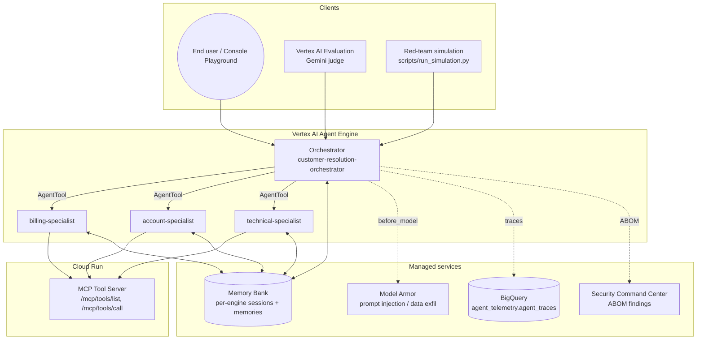

# GCP Agent Evaluation — Reference Implementation

A **production-grade reference** for building, evaluating, governing, and continuously
improving an LLM multi-agent system on Google Cloud — built on the **Agent Development
Kit (ADK)**, deployed to **Vertex AI Agent Engine**, with a **Cloud Run MCP server** for
tool execution.

> **Use case:** TechCorp's Customer Resolution Hub — an orchestrator routes support
> requests to billing, technical, and account specialists. The patterns apply to any
> multi-agent system that needs evaluation, governance, and a continuous-improvement
> loop on GCP.

---

## Architecture Overview



The orchestrator is a Gemini-Pro ADK agent that delegates to three Gemini-Flash
specialists via `AgentTool`. Specialists call deterministic tools (refunds,
account lookup, knowledge-base search) through the MCP server. All four agents
share the orchestrator's Memory Bank so cross-agent context survives a session.

---

## Project Structure

```
agent-evaluation-reference/
│
├── agents/                       # ADK agents (deployed to Agent Engine)
│   ├── _shared/
│   │   ├── config.py             # Models, region, display names, staging bucket
│   │   ├── versions.py           # ADK / aiplatform / genai pinned versions
│   │   ├── mcp_client.py         # Authenticated client → Cloud Run MCP
│   │   └── model_armor.py        # before_model callback enforcing the template
│   ├── orchestrator/app/         # Routes; PreloadMemoryTool + AgentTool wrappers
│   ├── billing_agent/app/
│   ├── account_agent/app/
│   └── technical_agent/app/
│
├── mcp_server/                   # Cloud Run service — tool execution layer
│   ├── app/main.py               # FastAPI; /mcp/tools/list, /mcp/tools/call
│   ├── app/auth.py               # OIDC token verification per agent identity
│   └── Dockerfile
│
├── src/agent_eval/               # Evaluation framework (Python package, CLI)
│   ├── agent/
│   │   ├── core.py               # CI mock agent (no deployment)
│   │   └── endpoint.py           # Live-agent client (Reasoning Engine resource)
│   ├── evaluation/
│   │   ├── runner.py             # Vertex AI EvalTask + safety-threshold gate
│   │   └── metrics.py            # Custom PointwiseMetricPromptTemplate rubric
│   └── utils/
│       ├── abom.py               # Agent Bill of Materials generator
│       ├── trace_logger.py       # BigQuery telemetry writer
│       ├── config.py             # Project resolution helpers
│       └── logger.py
│
├── scripts/                      # Lifecycle / ops tooling
│   ├── deploy_agent_engine.py    # Deploys orchestrator (+ wires Memory Bank)
│   ├── register_agents.py        # Deploys all 3 specialists
│   ├── redeploy_all.py           # Tears down + redeploys all 4 agents
│   ├── deploy_mcp_cloud_run.sh   # Builds + deploys MCP server to Cloud Run
│   ├── setup_enterprise_iam.sh   # Per-agent service accounts + Cloud Run IAM
│   ├── setup_model_armor.py      # Provisions the Model Armor template
│   ├── setup_telemetry_sink.py   # BigQuery dataset/table + log sink
│   ├── setup_alerting.py         # Cloud Monitoring policies + log-based metrics
│   ├── publish_scc_findings.py   # ABOM → Security Command Center finding
│   ├── smoke_test_agents.py      # End-to-end smoke (memory persistence, tools)
│   ├── load_test_agent_engine.py # Throughput + p95 latency probe
│   ├── run_simulation.py         # Adversarial red-team gate (auto-graded)
│   ├── trigger_tuning.py         # Optimize loop — BigQuery → SFT dataset → tune
│   ├── walkthrough_report.py     # End-of-deploy summary report
│   ├── patch_agent_labels.py     # Stamp ADK labels for Playground visibility
│   ├── register_tools.py         # Registers MCP as a Vertex AI Extension
│   ├── setup_wif.sh              # Workload Identity Federation for GitHub Actions
│   └── setup_github_secrets.sh   # Bulk-set repo secrets via gh
│
├── data/golden_dataset.json      # Evaluation test cases (prompts + references)
├── tests/                        # Unit tests (mocked, no GCP calls)
├── deploy/monitoring/dashboard.json  # Cloud Monitoring dashboard definition
├── .github/workflows/ci.yml      # CI quality gate (mock agent + Vertex judge)
├── pyproject.toml                # Package config + agent-eval CLI entrypoint
└── Makefile                      # Convenience targets — see `make help`
```

---

## The Four Lifecycle Phases

The repo is organised around a four-phase agent lifecycle. Each phase has scripts
under `scripts/` and one or more `make` targets.

| Phase | What runs | Key scripts |
|---|---|---|
| **Build** | Deploy MCP, deploy four ADK agents to Agent Engine, generate ABOM, publish SCC finding | `deploy_mcp_cloud_run.sh`, `deploy_agent_engine.py`, `register_agents.py`, `publish_scc_findings.py` |
| **Scale** | Smoke test, load test, patch ADK labels for Playground | `smoke_test_agents.py`, `load_test_agent_engine.py`, `patch_agent_labels.py` |
| **Govern** | Telemetry sink, alerting, red-team gate, Model Armor enforcement | `setup_telemetry_sink.py`, `setup_alerting.py`, `run_simulation.py`, `setup_model_armor.py` |
| **Optimize** | Pull weak responses from BigQuery, build SFT dataset, trigger Vertex AI tuning | `trigger_tuning.py` |

Run `make help` for the full target list.

---

## Quality Gate — CI vs Live

| | CI (PR gate) | Live (post-deploy) |
|---|---|---|
| **Triggers on** | Pull request to `main` | Manual / scheduled / post-`deploy` |
| **Agent target** | Local mock agent (`src/agent_eval/agent/core.py`) | Deployed Reasoning Engine resource (`AGENT_ENDPOINT=projects/.../reasoningEngines/...`) |
| **Tools** | Mocked | Real (MCP tools, Memory Bank, Model Armor) |
| **Cost** | Vertex AI judge calls only | Judge + live agent inference |
| **Blocks** | PR merge | Subsequent ramp / promotion |

The same `agent-eval run-eval` command drives both — the only difference is whether
`--endpoint` points at a Reasoning Engine resource.

---

## Quality Gate Thresholds

We split metrics into two buckets:

**Deterministic (threshold = 1.0).** Routing accuracy, tool-call trajectory,
safety/toxicity. Any drop is a build break — there's no acceptable margin for
the orchestrator routing a billing question to the technical specialist.

**Generative (threshold ≈ 0.85–0.90).** Groundedness, helpfulness, tone. These
are LLM-judged on free-form text, so a strict 1.0 cutoff produces false
positives on perfectly acceptable rephrases.

The bundled `--safety-threshold` flag defaults to 0.9 as the aggregated baseline.
Production systems should additionally enforce hard `<1.0` blocks on routing and
tool trajectory independently.

---

## Memory Bank

The orchestrator owns a Memory Bank; specialists are wired to share it. This
means a customer asking the orchestrator for a refund, getting handed off to
billing, and then mentioning their account email to account-specialist all see
the same memory state.

Two facts the SDK doesn't make obvious — and that took us a deploy or two to learn:

1. **Both ends must be wired.** `AdkApp(memory_service_builder=...)` is just a
   client factory. The Memory Bank itself only exists if `context_spec.memory_bank_config`
   is set on the Reasoning Engine resource. Without that, writes succeed at the
   SDK layer and zero memories ever persist. `deploy_agent_engine.py` does both.
2. **`delete_session` does NOT trigger memory generation.** Memories are only
   summarised when the session ends naturally (timeout). Smoke tests have to
   wait ~30 seconds (`MEMORY_PERSIST_WAIT_SECONDS`) before reading back.

---

## Governance Surface

Every Build-phase deploy emits an **ABOM** (Agent Bill of Materials) capturing:

- Agent display name + version (the deploying commit SHA)
- The exact deployed model (`orchestrator_agent.model` at deploy time)
- A SHA-256 hash of system instructions and the tool manifest
- The bound Model Armor template (or absence)
- The agent's GSA identity
- Pinned `requirements` versions

The ABOM is written to `build/abom.json` and published as a finding to **Security
Command Center**, so any subsequent governance scan has a fixed reference point
for what was deployed.

**Model Armor** is enforced at the orchestrator's `before_model_callback`. The
template is provisioned by `setup_model_armor.py`; its resource name is read from
`MODEL_ARMOR_TEMPLATE` env (or `model_armor_template.txt` at the repo root).

---

## Getting Started

### Prerequisites
- A GCP project with Vertex AI, Cloud Run, BigQuery, Security Command Center enabled
- `gcloud auth application-default login`
- Python 3.10+ (the Agent Engine ADK runtime requires it)

### 1. Bootstrap

```bash
make setup                                    # creates ./venv, installs -e ".[dev]"
cp .env.example .env                          # then fill in GCP_PROJECT, GCP_LOCATION
source .env                                   # or use direnv / dotenv
```

### 2. Provision IAM + MCP

```bash
./scripts/setup_enterprise_iam.sh $GCP_PROJECT $GCP_LOCATION
./scripts/deploy_mcp_cloud_run.sh   $GCP_PROJECT $GCP_LOCATION
# → writes mcp_server_url.txt at repo root
```

### 3. Deploy the four agents

```bash
export GCP_STAGING_BUCKET=gs://agent-eval-staging-$GCP_PROJECT  # or set GCP_STAGING_BUCKET_PREFIX
make enterprise-deploy
# orchestrator + 3 specialists now visible in Vertex AI Console → Agent Engine
```

`make enterprise-deploy` runs `deploy_agent_engine.py` (orchestrator, ABOM, SCC
finding) followed by `register_agents.py` (specialists, sharing the orchestrator's
Memory Bank).

### 4. Govern

```bash
make govern-setup                             # telemetry sink + alerts + SCC findings
python scripts/setup_model_armor.py           # provisions the safety template
```

### 5. Evaluate

```bash
# CI mode (mock agent — no deployment needed)
agent-eval run-eval --dataset data/golden_dataset.json

# Live mode — point at the deployed orchestrator Reasoning Engine
agent-eval run-eval \
  --dataset data/golden_dataset.json \
  --endpoint $(cat deployed_agent_resource.txt) \
  --safety-threshold 0.9
```

The CLI accepts a Reasoning Engine resource name OR an HTTP URL via `--endpoint`.

### 6. Optimize (optional)

```bash
TUNING_DRY_RUN=1 make optimize-trigger        # mines BigQuery, builds SFT data, dry-runs
TUNING_DRY_RUN=0 make optimize-trigger        # actually submits the Vertex AI SFT job
```

---

## Configuration

Every knob is an environment variable; see `.env.example` for the full list.
The most-touched ones:

| Var | Default | Purpose |
|---|---|---|
| `GCP_PROJECT` | *required* | Project ID — every script fails fast if unset |
| `GCP_LOCATION` | `us-central1` | Vertex / Agent Engine / Cloud Run region |
| `GCP_STAGING_BUCKET` | `gs://agent-eval-staging-<project>` | Where the SDK pickles agents |
| `GCP_STAGING_BUCKET_PREFIX` | `agent-eval-staging` | Override only the prefix, keep the `-<project>` suffix |
| `ORCHESTRATOR_MODEL` | `gemini-2.5-pro` | Routing/reasoning quality |
| `SPECIALIST_MODEL` | `gemini-2.5-flash` | Cost-optimised for specialists |
| `MEMORY_BANK_GENERATION_MODEL` | `gemini-2.5-flash` | Summarises sessions into memories |
| `MEMORY_BANK_EMBEDDING_MODEL` | `text-embedding-005` | Similarity search at recall time |
| `MCP_SERVER_URL` | written by `deploy_mcp_cloud_run.sh` | Audience for authenticated MCP calls |
| `MODEL_ARMOR_TEMPLATE` | written by `setup_model_armor.py` | Resource name of the safety template |
| `AGENT_ENDPOINT` | unset | Reasoning Engine resource OR URL for live eval |
| `*_DISPLAY_NAME` | `customer-resolution-orchestrator`, `billing-specialist`, etc. | Override only to run side-by-side with the reference stack |

Defaults are centralised in `agents/_shared/config.py`. `require("GCP_PROJECT")` is
used wherever a missing value should fail loud rather than silently target the
wrong project.

---

## CLI Reference

```bash
# CI mode — mock agent, no deployment
agent-eval run-eval --dataset data/golden_dataset.json

# Override project / region
agent-eval run-eval \
  --dataset data/golden_dataset.json \
  --project YOUR_PROJECT_ID \
  --location us-central1

# Live mode — evaluate a deployed Reasoning Engine
agent-eval run-eval \
  --dataset data/golden_dataset.json \
  --endpoint $(cat deployed_agent_resource.txt) \
  --safety-threshold 0.9 \
  --experiment cd-eval-$(git rev-parse --short HEAD)

agent-eval run-eval --help
```

---

## GitHub Actions — Workload Identity Federation

CI uses Workload Identity Federation so no long-lived JSON keys are stored.

```bash
./scripts/setup_wif.sh             $GCP_PROJECT  $GITHUB_USER/$REPO
./scripts/setup_github_secrets.sh  $GCP_PROJECT  $GITHUB_USER/$REPO   # uses gh CLI
```

Required repo secrets:

| Secret | Source |
|---|---|
| `GCP_WORKLOAD_IDENTITY_PROVIDER` | Output of `setup_wif.sh` |
| `GCP_SERVICE_ACCOUNT` | Output of `setup_wif.sh` |
| `GCP_PROJECT_ID` | Your project |

---

*Reference implementation for GCP Agentic AI Systems built on ADK + Vertex AI Agent Engine.*
