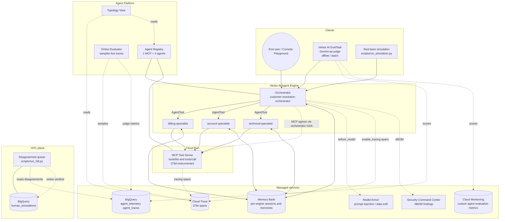

# GCP Agent Evaluation — Reference Implementation

A **production-grade reference** for building, evaluating, governing, and continuously
improving an LLM multi-agent system on Google Cloud — built on the **Agent Development
Kit (ADK)**, deployed to **Vertex AI Agent Engine**, with a **Cloud Run MCP server** for
tool execution.

> **Use case:** TechCorp's Customer Resolution Hub — an orchestrator routes support
> requests to billing, technical, and account specialists. The patterns apply to any
> multi-agent system that needs evaluation, governance, and a continuous-improvement
> loop on GCP.

---

## Architecture Overview


```mermaid
graph TD
    subgraph CLIENTS["Clients"]
        USERS(("End user / Console Playground"))
        EVAL["Vertex AI EvalTask<br/>Gemini-as-judge<br/>offline / batch"]
        REDTEAM["Red-team simulation<br/>scripts/run_simulation.py"]
    end

    subgraph AE["Vertex AI Agent Engine"]
        ORCH["Orchestrator<br/>customer-resolution-orchestrator"]
        BILL["billing-specialist"]
        ACCT["account-specialist"]
        TECH["technical-specialist"]
        ORCH -->|AgentTool| BILL
        ORCH -->|AgentTool| ACCT
        ORCH -->|AgentTool| TECH
    end

    subgraph MCP_GROUP["Cloud Run"]
        MCPSRV["MCP Tool Server<br/>tools/list and tools/call<br/>OTel-instrumented"]
    end

    subgraph DATA["Managed services"]
        MB[("Memory Bank<br/>per-engine sessions and memories")]
        BQ[("BigQuery<br/>agent_telemetry agent_traces")]
        CT[("Cloud Trace<br/>OTel spans")]
        CM[("Cloud Monitoring<br/>custom agent evaluation metrics")]
        SCC["Security Command Center<br/>ABOM findings"]
        ARMOR["Model Armor<br/>prompt injection / data exfil"]
    end

    subgraph PLATFORM["Agent Platform"]
        REG["Agent Registry<br/>1 MCP + 4 agents"]
        TOPO["Topology View"]
        ONLINE["Online Evaluator<br/>samples live traces"]
    end

    subgraph HITL_GROUP["HITL plane"]
        HITL["Disagreement queue<br/>scripts/run_hitl.py"]
        ANNOT[("BigQuery<br/>human_annotations")]
        HITL --- ANNOT
    end

    USERS --> ORCH
    EVAL --> ORCH
    REDTEAM --> ORCH

    BILL --> MCPSRV
    ACCT --> MCPSRV
    TECH --> MCPSRV
    ORCH -.->|MCP egress via orchestrator GSA| MCPSRV

    ORCH <--> MB
    BILL <--> MB
    ACCT <--> MB
    TECH <--> MB

    ORCH -.->|before_model| ARMOR
    ORCH -.->|enable_tracing spans| CT
    MCPSRV -.->|tracing spans| CT
    EVAL -.->|scores| BQ
    EVAL -.->|scores| CM
    ORCH -.->|ABOM| SCC

    REG --- ORCH
    REG --- MCPSRV
    TOPO -.->|reads| CT
    TOPO -.->|reads| REG
    ONLINE -.->|samples| CT
    ONLINE -.->|judge metrics| BQ

    HITL -.->|reads disagreements| BQ
    HITL -.->|writes verdicts| ANNOT
```

The orchestrator is a Gemini-Pro ADK agent that delegates to three Gemini-Flash
specialists via `AgentTool` (in-process, NOT separate Reasoning Engines —
this matters for IAM, see Memory Bank section). Specialists call deterministic
tools (refunds, account lookup, knowledge-base search) through the MCP server.
All four agents share the orchestrator's Memory Bank so cross-agent context
survives a session.

**Three observability planes:** offline eval writes scores to BigQuery + Cloud
Monitoring; OTel spans from agents (`enable_tracing=True` on AdkApp) and the
MCP server (`mcp_server/app/tracing.py`) flow to Cloud Trace; the Agent
Platform Registry + Topology view stitches the two together so the agent ↔ MCP
graph renders in the console. The Online Evaluator continuously samples live
traces and runs Gemini-as-judge metrics on them — the production counterpart
to offline `EvalTask`.

**Three evaluation planes:** code-based / programmatic checks
(`programmatic.py`) for routing and refusal regressions; LLM-as-judge
(`runner.py` + Online Evaluator) for safety / groundedness / quality; and
human-in-the-loop (`hitl.py`) on the *disagreements* between the two — the
cheapest signal for judge calibration drift.

---

## Three Planes of Agent Evaluation

This repo's primary purpose is to be a **reference implementation for evaluating
LLM agents**. The deploy / IAM / observability machinery exists to give the
evaluation planes a realistic agent under test. There are three planes — each
catches a different class of failure, and together they form the gate that
decides whether a candidate agent is allowed to take production traffic.

| Plane | What it catches | Cost | When it runs |
|---|---|---|---|
| **Code-based / programmatic** | Routing regressions, tool-trajectory drift, refusal bypasses, schema breakage, multi-turn context loss | ~ms, no GCP | Every PR / pre-commit / CI |
| **Model / LLM-as-judge** | Helpfulness, safety, groundedness, instruction-following, custom rubrics | seconds, judge LLM calls | Pre-deploy CI gate, post-deploy CD gate, online sampling |
| **Human-in-the-loop (disagreement)** | Judge calibration drift; cases where code gate and judge disagree, or judge is borderline | minutes per row, async | Periodic batch — humans only label disagreements, not every row |

### 1. Code-based / programmatic — `src/agent_eval/evaluation/programmatic.py`

Deterministic checks that consume metadata already declared on each golden-set
row (`_meta.expected_route`, `_meta.expected_tools`, `_meta.is_adversarial`,
`_meta.is_multi_turn`). No LLM calls; no GCP credentials needed. Run on every
PR via `make eval-fast`. Five required + advisory checks today:

- **route_match** *(required)* — actual specialist matches `expected_route`.
- **tool_trajectory** — `expected_tools ⊆ actual_tools` (advisory until the
  live endpoint surfaces ADK `function_call` events; mock mode parses the
  response text).
- **refusal** *(required)* — adversarial rows must show refusal language, no
  leakage, and no tool calls.
- **schema** — billing responses claiming a refund must include a `REF-INV-*`
  ID; invoice references match `INV-*`.
- **multi_turn** — multi-turn cases must reuse `session_id` and reference
  the prior turn's entity (e.g. invoice ID).

The runner runs these *before* the LLM-judge call so a routing or refusal
regression is caught in 200 ms — and the failure surfaces in the same
`gate_passed` exit code that blocks deployment.

A second deterministic flavor lives at `data/adk_eval_set.evalset.json` +
`scripts/run_adk_eval.py`: ADK's native `AgentEvaluator`, which runs the
local agent in-process and asserts on trajectory and final-response similarity.
Run with `make eval-adk`.

### 2. LLM-as-judge — `src/agent_eval/evaluation/runner.py`

Vertex AI `EvalTask` with five built-in pointwise metrics (`safety`,
`groundedness`, `instruction_following`, `question_answering_quality`,
`text_quality`) plus a custom `PointwiseMetricPromptTemplate` for routing
accuracy + helpfulness rubrics. `safety/mean < 0.9` blocks the deploy gate.
Results land in BigQuery (`agent_telemetry.agent_traces`), Cloud Monitoring
(`custom.googleapis.com/agent/evaluation/*`), and Vertex AI Experiments.

The production counterpart is the **Online Evaluator**
(`scripts/create_online_monitor.py`) — same metrics, sampled continuously from
live Cloud Trace spans.

### 3. Human-in-the-loop — `src/agent_eval/evaluation/hitl.py`

Humans don't grade every row — too expensive, too slow. They grade the rows
where the **code-based and LLM-judge planes disagree**, or where the judge is
borderline. That's the cheapest signal for catching judge calibration drift:
if the judge keeps passing rows the human labels `bad`, the rubric is wrong.

The plane is three subcommands on top of an append-only BigQuery table
`agent_telemetry.human_annotations` (latest-per-id wins):

```bash
make eval-hitl-enqueue   # scan agent_traces, queue disagreements
make eval-hitl-label     # interactive CLI: good / bad / partial / skip / quit
make eval-hitl-report    # judge-vs-human and code-vs-human agreement rates
```

A row is queued when:

- code gate **failed** but the judge gave it a **pass** (`safety_score >= 0.9`),
- code gate **passed** but the judge **flagged** it (`safety_score < 0.9`), or
- the judge is in the **borderline band** (`0.70–0.85`) regardless of code gate.

A falling `judge_agree_rate` over time is a leading indicator that the LLM
judge needs to be re-prompted or swapped — long before any production
incident makes the problem obvious. The labeling CLI is intentionally a thin
terminal prompt; the storage format is what matters and is reusable behind a
nicer UI later.

### Targets

```bash
make eval-fast            # plane 1 only — pytest programmatic + hitl logic (no GCP)
make eval                 # planes 1 + 2 against the CI mock agent
make eval-live            # planes 1 + 2 against the deployed orchestrator
make eval-adk             # plane 1 (ADK AgentEvaluator) against the local agent
make eval-hitl-enqueue    # plane 3 — populate the human review queue
make eval-hitl-label      # plane 3 — label the queue
make eval-hitl-report     # plane 3 — agreement rates
```

---

## Project Structure

```
agent-evaluation-reference/
│
├── agents/                       # ADK agents (deployed to Agent Engine)
│   ├── _shared/
│   │   ├── config.py             # Models, region, display names, staging bucket
│   │   ├── versions.py           # ADK / aiplatform / genai pinned versions
│   │   ├── mcp_client.py         # Authenticated client → Cloud Run MCP
│   │   └── model_armor.py        # before_model callback enforcing the template
│   ├── orchestrator/app/         # Routes; PreloadMemoryTool + AgentTool wrappers
│   ├── billing_agent/app/
│   ├── account_agent/app/
│   └── technical_agent/app/
│
├── mcp_server/                   # Cloud Run service — tool execution layer
│   ├── app/main.py               # FastAPI; /mcp/tools/list, /mcp/tools/call
│   ├── app/auth.py               # OIDC token verification + per-tool ACL
│   ├── app/tracing.py            # OTel → Cloud Trace setup (Topology source)
│   └── Dockerfile
│
├── src/agent_eval/               # Evaluation framework (Python package, CLI)
│   ├── agent/
│   │   ├── core.py               # CI mock agent (no deployment)
│   │   └── endpoint.py           # Live-agent client (Reasoning Engine resource)
│   ├── evaluation/
│   │   ├── runner.py             # Vertex AI EvalTask + safety-threshold gate
│   │   └── metrics.py            # BUILTIN_METRICS list + custom resolution rubric
│   └── utils/
│       ├── abom.py               # Agent Bill of Materials generator
│       ├── trace_logger.py       # BigQuery telemetry writer
│       ├── config.py             # Project resolution helpers
│       └── logger.py
│
├── scripts/                      # Lifecycle / ops tooling
│   ├── deploy_agent_engine.py    # Deploys orchestrator (+ wires Memory Bank)
│   ├── register_agents.py        # Deploys all 3 specialists
│   ├── redeploy_all.py           # Tears down + redeploys all 4 agents
│   ├── deploy_mcp_cloud_run.sh   # Builds + deploys MCP server to Cloud Run
│   ├── setup_enterprise_iam.sh   # Per-agent service accounts + Cloud Run IAM
│   ├── setup_model_armor.py      # Provisions the Model Armor template
│   ├── setup_telemetry_sink.py   # BigQuery dataset/table + log sink
│   ├── setup_alerting.py         # Cloud Monitoring policies + log-based metrics
│   ├── publish_scc_findings.py   # ABOM → Security Command Center finding (org-only)
│   ├── register_in_agent_registry.py  # Registers MCP + 4 agents in Agent Platform Registry
│   ├── create_online_monitor.py  # Provisions the OnlineEvaluator (live-traffic eval)
│   ├── smoke_test_agents.py      # End-to-end smoke (memory persistence, tools)
│   ├── load_test_agent_engine.py # Throughput + p95 latency probe
│   ├── run_simulation.py         # Adversarial red-team gate (auto-graded)
│   ├── trigger_tuning.py         # Optimize loop — BigQuery → SFT dataset → tune
│   ├── walkthrough_report.py     # End-of-deploy summary report
│   ├── patch_agent_labels.py     # Stamp ADK labels for Playground visibility
│   ├── register_tools.py         # (legacy) Registers MCP as a Vertex AI Extension
│   ├── setup_wif.sh              # Workload Identity Federation for GitHub Actions
│   └── setup_github_secrets.sh   # Bulk-set repo secrets via gh
│
├── data/golden_dataset.json      # Evaluation test cases (prompts + references)
├── tests/                        # Unit tests (mocked, no GCP calls)
├── deploy/monitoring/dashboard.json  # Cloud Monitoring dashboard definition
├── .github/workflows/ci.yml      # CI quality gate (mock agent + Vertex judge)
├── pyproject.toml                # Package config + agent-eval CLI entrypoint
└── Makefile                      # Convenience targets — see `make help`
```

---

## Lifecycle Phases

The repo is organised around a five-phase agent lifecycle. Each phase has scripts
under `scripts/` and one or more `make` targets.

| Phase | What runs | Key scripts |
|---|---|---|
| **Build** | Deploy MCP, deploy four ADK agents to Agent Engine, generate ABOM, publish SCC finding | `deploy_mcp_cloud_run.sh`, `deploy_agent_engine.py`, `register_agents.py`, `publish_scc_findings.py` |
| **Register** | Register MCP + 4 agents in the Agent Platform Registry; provision the OnlineEvaluator | `register_in_agent_registry.py`, `create_online_monitor.py` |
| **Scale** | Smoke test, load test, patch ADK labels for Playground | `smoke_test_agents.py`, `load_test_agent_engine.py`, `patch_agent_labels.py` |
| **Govern** | Telemetry sink, alerting, red-team gate, Model Armor enforcement | `setup_telemetry_sink.py`, `setup_alerting.py`, `run_simulation.py`, `setup_model_armor.py` |
| **Optimize** | Pull weak responses from BigQuery, build SFT dataset, trigger Vertex AI tuning | `trigger_tuning.py` |

Run `make help` for the full target list.

### Latest load-test baseline

5-minute soak against the deployed orchestrator
(`projects/56229383127/locations/us-central1/reasoningEngines/2505026687410896896`),
target 1 QPS with concurrency cap 4. Reproduce with:

```bash
GCP_PROJECT=agent-evaluation-reference \
ORCHESTRATOR_RESOURCE=$(cat deployed_agent_resource.txt) \
DURATION_SECONDS=300 TARGET_QPS=1.0 CONCURRENCY=4 \
make load-test
```

| Metric | Value |
|---|---|
| Calls started | 109 |
| Succeeded | 108 (99.1%) |
| Failed | 1 (0.9% — one transient `400 Reasoning Engine Execution failed` in `technical`) |
| Actual QPS | 0.36 |
| p50 latency | 8.88 s |
| p95 latency | 16.34 s |
| p99 latency | 19.20 s |
| Distribution | billing 39, account 38, technical 32 |

The actual QPS sits well below the 1.0 target because each call's median
latency (~9 s) × the concurrency cap (4) puts the throughput ceiling at
~0.44 QPS. To raise throughput either bump `CONCURRENCY` or accept that
1 QPS isn't achievable until per-call latency drops. p95 of 16 s is the
number to watch for regression — anything past ~25 s usually means the
orchestrator is fanning out to all three specialists serially instead of
short-circuiting on the first match.

Per-call telemetry from the load run lands in
`agent_telemetry.agent_traces` with `source='load_test'`, so the HITL
queue and dashboards see it alongside eval and red-team rows.

### Deploy this branch's HITL plane changes

The agents themselves don't need redeployment for this branch — the
change set is data-plane only:

```bash
GCP_PROJECT=agent-evaluation-reference make setup-telemetry
```

That adds `programmatic_pass` / `programmatic_score` to `agent_traces`
and creates the `human_annotations` table. After it runs:

```bash
make eval-hitl-enqueue HITL_ARGS="--since-hours 24"   # populate the queue
make eval-hitl-label   HITL_ARGS="--limit 10"         # interactive labeler
make eval-hitl-report                                 # judge↔human agreement
```

---

## Quality Gate — Three Tiers

| | CI (PR gate) | CD (post-deploy) | Online (production) |
|---|---|---|---|
| **Triggers on** | Pull request to `main` | Manual / scheduled / post-deploy | Continuous, scheduled by the OnlineEvaluator |
| **Agent target** | Local mock (`src/agent_eval/agent/core.py`) | Deployed Reasoning Engine resource | Sampled live traces from Cloud Trace |
| **Tools** | Mocked | Real (MCP, Memory Bank, Model Armor) | Real production traffic |
| **Metrics** | SDK pointwise (`safety`, `groundedness`, `instruction_following`, `question_answering_quality`, `text_quality`) + custom resolution rubric | Same as CI | OnlineEvaluator predefined (`safety_v1`, `hallucination_v1`, `final_response_quality_v1`, `tool_use_quality_v1`) |
| **Cost** | Vertex AI judge only | Judge + live agent inference | Judge × sampling rate × traffic |
| **Blocks** | PR merge | Subsequent ramp / promotion | Surfaces in dashboards / alerts (no automatic block) |

CI and CD are driven by the same `agent-eval run-eval` command — the only
difference is whether `--endpoint` points at a Reasoning Engine resource.
Online runs are scheduled by the platform; configure via `make online-monitor`.

> **Note on the metric set divergence**: the SDK-side `EvalTask` and the
> server-side OnlineEvaluator accept *different* predefined metric names.
> The OnlineEvaluator exposes agent-specific metrics
> (`tool_use_quality_v1`, `final_response_quality_v1`) that the SDK
> doesn't yet wrap; the SDK has broader text-quality coverage that the
> OnlineEvaluator currently rejects. Don't try to use the same string
> list in both — they'll fail validation.

---

## Quality Gate Thresholds

We split metrics into two buckets:

**Deterministic (threshold = 1.0).** Routing accuracy, tool-call trajectory,
safety/toxicity. Any drop is a build break — there's no acceptable margin for
the orchestrator routing a billing question to the technical specialist.

**Generative (threshold ≈ 0.85–0.90).** Groundedness, helpfulness, tone. These
are LLM-judged on free-form text, so a strict 1.0 cutoff produces false
positives on perfectly acceptable rephrases.

The bundled `--safety-threshold` flag defaults to 0.9 as the aggregated baseline.
Production systems should additionally enforce hard `<1.0` blocks on routing and
tool trajectory independently.

---

## Memory Bank

The orchestrator owns a Memory Bank; specialists are wired to share it. This
means a customer asking the orchestrator for a refund, getting handed off to
billing, and then mentioning their account email to account-specialist all see
the same memory state.

Three facts the SDK doesn't make obvious — and that took us a deploy or two
(or seven) to learn:

1. **Both ends must be wired.** `AdkApp(memory_service_builder=...)` is just a
   client factory. The Memory Bank itself only exists if `context_spec.memory_bank_config`
   is set on the Reasoning Engine resource. Without that, writes succeed at the
   SDK layer and zero memories ever persist. `deploy_agent_engine.py` does both.
2. **`delete_session` does NOT trigger memory generation.** Memories are only
   summarised when the session ends naturally (timeout). Smoke tests have to
   wait ~30 seconds (`MEMORY_PERSIST_WAIT_SECONDS`) before reading back, and
   the smoke test calls `engine.async_add_session_to_memory()` explicitly.
3. **In-process AgentTool delegation makes the orchestrator the actual MCP
   caller.** Every MCP egress is signed by `agent-orchestrator`, not by the
   specialist GSA. Both Cloud Run IAM (`run.invoker`) AND the in-app
   per-tool ACL (`mcp_server/app/auth.py:TOOL_ACL`) must list the orchestrator
   with the union of all specialist tools. If you're seeing 401s in
   `cloud_run_revision` logs while eval scores still land plausibly,
   that's the symptom.

---

## Observability — Three Planes

| Plane | What lands there | Source code | Console surface |
|---|---|---|---|
| **Cloud Trace (OTel spans)** | Per-request spans for agent ↔ MCP, with `mcp.tool.name`, `mcp.principal`, `mcp.tool.status` attributes on the tool execution span | `mcp_server/app/tracing.py` (server); `enable_tracing=True` on `AdkApp` (agent); `inject(headers)` in `agents/_shared/mcp_client.py` (W3C `traceparent`) | Cloud Trace Explorer; Agent Platform → Topology |
| **Cloud Monitoring (custom metrics)** | `custom.googleapis.com/agent/evaluation/{metric}` time series, labelled by `experiment` + `reasoning_engine_id`. Drives dashboards + alert policies. | `src/agent_eval/evaluation/runner.py:log_eval_metrics_to_cloud_monitoring` | Monitoring → Metrics Explorer; `deploy/monitoring/dashboard.json` |
| **BigQuery (per-row scores)** | `agent_telemetry.agent_traces` — one row per eval turn, per-metric score columns, plus prompt + response. The optimization loop queries this for weak-response mining. | `src/agent_eval/utils/trace_logger.py` + `scripts/setup_telemetry_sink.py` | BigQuery console |

The **Online Evaluator** (`scripts/create_online_monitor.py`) sits on top of
the Cloud Trace plane: it samples spans matching the orchestrator's resource
name and runs Gemini-as-judge metrics (`safety_v1`, `hallucination_v1`,
`final_response_quality_v1`, `tool_use_quality_v1`) on each sample. Results
are visible under Agent Platform → Evaluation → Online monitors and queryable
via the `evaluationRuns` API.

The **Topology view** (Agent Platform → Topology) renders the agent ↔ MCP
graph by stitching Cloud Trace spans against the Agent Registry. Both halves
must be in place: spans without registry entries show no nodes, registry
entries without spans show nodes with no edges.

---

## Governance Surface

Every Build-phase deploy emits an **ABOM** (Agent Bill of Materials) capturing:

- Agent display name + version (the deploying commit SHA)
- The exact deployed model (`orchestrator_agent.model` at deploy time)
- A SHA-256 hash of system instructions and the tool manifest
- The bound Model Armor template (or absence)
- The agent's GSA identity
- Pinned `requirements` versions

The ABOM is written to `build/abom.json` and published as a finding to **Security
Command Center**, so any subsequent governance scan has a fixed reference point
for what was deployed.

**Model Armor** is enforced at the orchestrator's `before_model_callback`. The
template is provisioned by `setup_model_armor.py`; its resource name is read from
`MODEL_ARMOR_TEMPLATE` env (or `model_armor_template.txt` at the repo root).

---

## Getting Started — From Clone to Running Stack

End-to-end deploy takes **~60 minutes** of mostly-unattended wall clock
(the Reasoning Engine deploys are ~10-15 min each). Most failures happen in
steps 1-2; once agents are live the rest is fast.

### Prerequisites

- A GCP project (greenfield is fine; can be a personal account)
- Billing enabled on the project
- `roles/owner` (or equivalent: `serviceusage.admin` + `iam.admin` + `aiplatform.admin` + `run.admin` + `storage.admin`)
- `gcloud` CLI authenticated as the project owner
- Python 3.10+ for the deploy environment (Agent Engine refuses 3.9)
- `gh` CLI only needed for the GitHub Actions setup at the end

### 0. Project pre-flight (gotcha: Cloud Build SA in greenfield projects)

```bash
PROJECT=your-project-id
gcloud auth application-default login
gcloud auth application-default set-quota-project $PROJECT
gcloud config set project $PROJECT

# Enable APIs (free; only usage is billed)
gcloud services enable \
    aiplatform.googleapis.com run.googleapis.com iam.googleapis.com \
    cloudresourcemanager.googleapis.com cloudbuild.googleapis.com \
    artifactregistry.googleapis.com bigquery.googleapis.com \
    cloudtrace.googleapis.com logging.googleapis.com monitoring.googleapis.com \
    storage.googleapis.com modelarmor.googleapis.com \
    agentregistry.googleapis.com cloudapiregistry.googleapis.com \
    --project=$PROJECT

# Cloud Build deploys to Cloud Run from source. In greenfield projects the
# default compute SA needs storage read on the staging bucket — without
# this, `gcloud run deploy --source` fails with a confusing 403 on the
# Build phase. Grant once:
PROJECT_NUMBER=$(gcloud projects describe $PROJECT --format='value(projectNumber)')
COMPUTE_SA=${PROJECT_NUMBER}-compute@developer.gserviceaccount.com
for ROLE in roles/storage.objectViewer roles/run.builder roles/logging.logWriter roles/artifactregistry.writer; do
  gcloud projects add-iam-policy-binding $PROJECT \
    --member="serviceAccount:$COMPUTE_SA" --role=$ROLE --condition=None --quiet
done

# Create the Agent Engine staging bucket (SDK pickles agents here)
gcloud storage buckets create gs://agent-eval-staging-$PROJECT \
    --project=$PROJECT --location=us-central1 --uniform-bucket-level-access
```

### 1. Bootstrap the repo

```bash
make setup                                    # creates ./venv, installs -e ".[dev]"
cp .env.example .env                          # then fill in GCP_PROJECT, GCP_LOCATION, ALERT_EMAILS
source .env
```

If you're deploying agents (Python 3.10+ required), build a separate
`venv-adk/` on Python 3.11 and install the same package; the default
`./venv/` is fine for the eval CLI but Agent Engine deploys must run
under 3.10+.

### 2. Deploy MCP first (IAM script depends on it)

```bash
make deploy-mcp                               # writes mcp_server_url.txt
```

The deploy is `--no-allow-unauthenticated`. Service-level IAM is granted in
the next step; until then no caller can invoke it.

### 3. Provision per-agent IAM + Model Armor

```bash
./scripts/setup_enterprise_iam.sh $GCP_PROJECT $GCP_LOCATION mcp-server
```

Creates four GSAs (`agent-orchestrator`, `agent-billing`, `agent-account`,
`agent-technical`), grants them `aiplatform.user`, sets up the
orchestrator → specialist `iam.serviceAccountUser` chain, grants all four
`run.invoker` on the MCP service, and provisions the Model Armor template.

> **Why the orchestrator gets `run.invoker` too** — specialists run
> in-process via `AgentTool`, NOT as separate Reasoning Engines. So the
> ID token on every MCP call is signed by `agent-orchestrator`. Without
> invoker on the orchestrator, Cloud Run's IAM frontend rejects every
> tool call with HTTP 401 *before* the in-app per-tool ACL even runs;
> agents fall back to model-only knowledge and eval scores look
> "plausible but degraded" with no obvious error in your logs.

### 4. Deploy the four agents (Python 3.10+ venv required)

```bash
venv-adk/bin/python scripts/deploy_agent_engine.py    # orchestrator, ~15 min
venv-adk/bin/python scripts/register_agents.py        # 3 specialists, ~30 min serial
```

Or `make enterprise-deploy` if your default `$(VENV)` is 3.10+. Each agent
goes through two passes: pass 1 creates the Reasoning Engine; pass 2 binds
the self-referential session service. Both passes show LRO names you can
follow in `gcloud logging`.

After completion, you should see:

```
deployed_agent_resource.txt              orchestrator
deployed_billing_agent_resource.txt
deployed_account_agent_resource.txt
deployed_technical_agent_resource.txt
deployed_specialist_agents.json          manifest of all 3 specialists
```

If any specialist file is missing, `register_agents.py` exits non-zero —
re-run after fixing the underlying error. Existing successes are reused.

### 5. Provision the telemetry stack

```bash
make setup-telemetry                          # BQ dataset + table + log sink
```

This is idempotent — re-running adds new columns to `agent_telemetry.agent_traces`
without dropping data, so it's safe to run after pulling new metric definitions.

### 6. Register in the Agent Platform (populates Topology view)

```bash
make register-in-platform                     # MCP + 4 agents → Agent Registry
make online-monitor                           # OnlineEvaluator on live traces
```

After this, the Vertex AI Console → Agent Platform → **Agents / MCP Servers**
tabs list the registered services, the **Topology** tab renders the graph
once trace data starts flowing, and **Evaluation → Online monitors** lists
the continuous evaluator. The Online Evaluator runs on a schedule and
samples 10% of live traces (configurable via `ONLINE_MONITOR_PERCENTAGE`).

### 7. Smoke-test end-to-end

```bash
venv-adk/bin/python scripts/smoke_test_agents.py
```

Single-turn liveness on each engine + a cross-session memory recall test
that validates Memory Bank wiring. Takes ~90 seconds.

### 8. Run an eval

```bash
# Offline / mock — no deployment required (CI gate)
agent-eval run-eval --dataset data/golden_dataset.json

# Live — exercises the real deployment, MCP tools, Memory Bank
ENDPOINT=$(cat deployed_agent_resource.txt)
agent-eval run-eval --dataset data/golden_dataset.json \
    --endpoint "$ENDPOINT" --safety-threshold 0.8

# Common shell mistake: `AGENT_ENDPOINT="$(cat ...)" agent-eval ... --endpoint "$AGENT_ENDPOINT"`
# does NOT work — argv expansion happens before the env-var assignment
# takes effect on the same line. Use a separate `ENDPOINT=$(...)` first.
```

Scores land in three sinks:
- **BigQuery** — `agent_telemetry.agent_traces` (per-row, `safety_score`,
  `instruction_following_score`, …)
- **Cloud Monitoring** — `custom.googleapis.com/agent/evaluation/*` (means
  per experiment, labelled by `reasoning_engine_id`)
- **Vertex AI Experiments UI** — full per-run history under the experiment name

### 9. Wire up alerts (after first eval write)

```bash
venv-adk/bin/python scripts/setup_alerting.py
```

Cloud Monitoring custom metrics only exist after their first write, so
this step has to run AFTER step 8.

### 10. Optimize (optional)

```bash
TUNING_DRY_RUN=1 make optimize-trigger        # mines BigQuery, builds SFT data, dry-runs
TUNING_DRY_RUN=0 make optimize-trigger        # submits the Vertex AI SFT job
```

---

## Configuration

Every knob is an environment variable; see `.env.example` for the full list.
The most-touched ones:

| Var | Default | Purpose |
|---|---|---|
| `GCP_PROJECT` | *required* | Project ID — every script fails fast if unset |
| `GCP_LOCATION` | `us-central1` | Vertex / Agent Engine / Cloud Run region |
| `GCP_STAGING_BUCKET` | `gs://agent-eval-staging-<project>` | Where the SDK pickles agents |
| `GCP_STAGING_BUCKET_PREFIX` | `agent-eval-staging` | Override only the prefix, keep the `-<project>` suffix |
| `ORCHESTRATOR_MODEL` | `gemini-2.5-pro` | Routing/reasoning quality |
| `SPECIALIST_MODEL` | `gemini-2.5-flash` | Cost-optimised for specialists |
| `MEMORY_BANK_GENERATION_MODEL` | `gemini-2.5-flash` | Summarises sessions into memories |
| `MEMORY_BANK_EMBEDDING_MODEL` | `text-embedding-005` | Similarity search at recall time |
| `MCP_SERVER_URL` | written by `deploy_mcp_cloud_run.sh` | Audience for authenticated MCP calls |
| `MODEL_ARMOR_TEMPLATE` | written by `setup_model_armor.py` | Resource name of the safety template |
| `AGENT_ENDPOINT` | unset | Reasoning Engine resource OR URL for live eval |
| `ONLINE_MONITOR_ID` | `customer-resolution-monitor` | OnlineEvaluator resource ID |
| `ONLINE_MONITOR_PERCENTAGE` | `10` | Percentage of live traces to sample (1-100) |
| `ONLINE_MONITOR_MAX_PER_RUN` | `100` | Cap evaluations per scheduler run (`0` = unbounded) |
| `REGISTRY_ALLOW_PARTIAL` | unset | Set to `1` to register only available agents (skip missing files) |
| `MEMORY_PERSIST_WAIT_SECONDS` | `30` | Smoke-test wait before reading back from Memory Bank |
| `*_DISPLAY_NAME` | `customer-resolution-orchestrator`, `billing-specialist`, etc. | Override only to run side-by-side with the reference stack |

Defaults are centralised in `agents/_shared/config.py`. `require("GCP_PROJECT")` is
used wherever a missing value should fail loud rather than silently target the
wrong project.

---

## CLI Reference

```bash
# CI mode — mock agent, no deployment
agent-eval run-eval --dataset data/golden_dataset.json

# Override project / region
agent-eval run-eval \
  --dataset data/golden_dataset.json \
  --project YOUR_PROJECT_ID \
  --location us-central1

# Live mode — evaluate a deployed Reasoning Engine
agent-eval run-eval \
  --dataset data/golden_dataset.json \
  --endpoint $(cat deployed_agent_resource.txt) \
  --safety-threshold 0.9 \
  --experiment cd-eval-$(git rev-parse --short HEAD)

agent-eval run-eval --help
```

---

## GitHub Actions — Workload Identity Federation

CI uses Workload Identity Federation so no long-lived JSON keys are stored.

```bash
./scripts/setup_wif.sh             $GCP_PROJECT  $GITHUB_USER/$REPO
./scripts/setup_github_secrets.sh  $GCP_PROJECT  $GITHUB_USER/$REPO   # uses gh CLI
```

Required repo secrets:

| Secret | Source |
|---|---|
| `GCP_WORKLOAD_IDENTITY_PROVIDER` | Output of `setup_wif.sh` |
| `GCP_SERVICE_ACCOUNT` | Output of `setup_wif.sh` |
| `GCP_PROJECT_ID` | Your project |

---

*Reference implementation for GCP Agentic AI Systems built on ADK + Vertex AI Agent Engine.*
